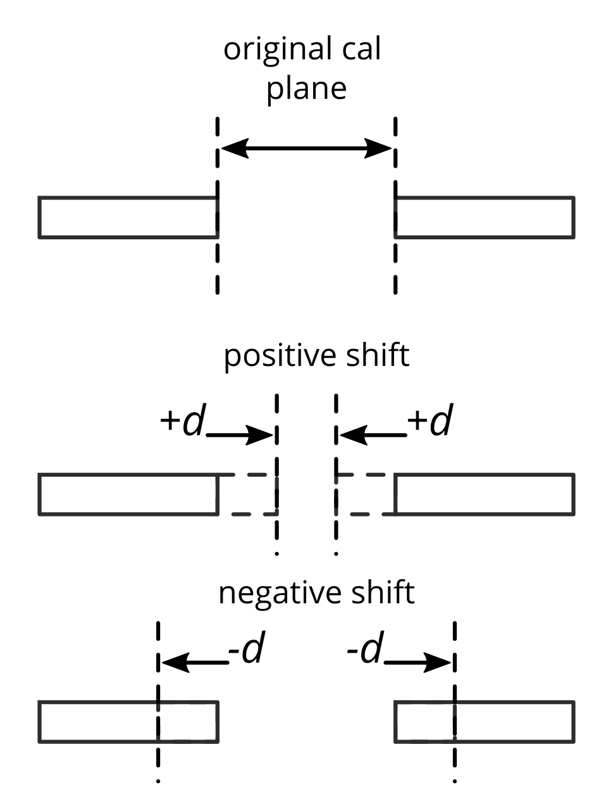

# Multiline TRL Calibration

Implementation of multiline TRL calibration. Two algorithms are included here:

1. An “improved” implementation based on a work of mine [1]. You can also download my PowerPoint slides I presented at ARFTG 98 from this link: https://graz.pure.elsevier.com/en/activities/improving-the-reliability-of-the-multiline-trl-calibration-algori 
2. The classical MultiCal implementation from NIST [2,3].

## Difference between implementations

NIST MultiCal [2,3]:

1. Assumes that error in the measurements can be modeled linearly in the solution of the calibration coefficients (eigenvectors).
2. Given that linearity assumption holds, then one can solve multiple eigenvalue problems and combine their result using the Gauss-Markov BLUE estimator (weighted sum) to obtain a final solution.
3. The weighing is done on the solutions (eigenvectors) and not the measurements.

TUG mTRL [1]:

1. Makes no assumption on the type of error propagated through the calibration coefficients.
2. A weighting matrix is derived to combine the measurements optimally (minimize eigenvectors sensitivity).
3. The weighting is done on the measurements to create a single eigenvalue problem to solve.

W**hy the method I’m presenting (TUG mTRL [1]) is better?**

The simple answer is that it does not enforces any assumption on the type of disturbance on your measurements. It just give the best solution it can deliver given what you provided it.

## Code requirements

First, these three files need to be in the same folder `mTRL.py`, `MultiCal.py`, `TUGmTRL.py` , and you will load the file `mTRL.py` in your main script (also, in same folder).

Secondly, you need to have `numpy`, `scipy`, `matplotlib`, and `scikit-rf` installed in your python environment.

```powershell
python -m pip install -U numpy scipy matplotlib scikit-rf
```

## How to use

Below is a sample code on how to run an mTRL calibration:

```python
from mTRL import mTRL  # (MultiCal.py and TUGmTRL.py must also be in same folder)
import skrf as rf

# Measured calibration standards
L1    = rf.Network('measured_line_1.s2p')
L2    = rf.Network('measured_line_2.s2p')
L3    = rf.Network('measured_line_3.s2p')
L4    = rf.Network('measured_line_4.s2p')
SHORT = rf.Network('measured_short.s2p')

lines = [L1, L2, L3, L4]
line_lengths = [0, 1e-3, 3e-3, 5e-3]  # in units of meters
reflect = [SHORT]
reflect_est = [-1]
reflect_offset = [0]

# define the calibration
cal = mTRL(lines=lines, line_lengths=line_lengths, reflect=reflect, 
               reflect_est=reflect_est, reflect_offset=reflect_offset)
cal.run_tug()      # run TUGmTRL calibration

dut = rf.Network('measured_dut.s2p')
cal_dut = cal.apply_cal(dut) # apply cal to a dut

# estimated propagation constant
line_gamma = cal.gamma

# effective dielectric constant
line_ereff = cal.ereff
```

## Shifting calibration plane

Be aware that after you finish the calibration, the mTRL sets the calibration plane in the middle of the first line you specify in the list of lines; regardless whether it is the shortest or longest. Therefore, if you want the cal plane to be somewhere else, you can shift the plane after calibration as follows

```python
cal.shift_plane(d)  # d is the shift in units of meters 
# the cal coefficients are updated with the new cal plane
cal_dut = cal.apply_cal(dut)
```

The way you specify *d* (i.e., the applied offset) is as shown in the image below



If your Thru standard (i.e., the first line) has a non-zero length, and you want the cal plane to be on the edges of the Thru line, then you negatively shift by half of its length:

```python
cal.shift_plane(-thru_length/2)
```

## Impedance renormalization

By default, the reference impedance after you finish a mTRL calibration is set to the characteristic impedance of the line standards (even if you don’t know it). In many cases, the used transmission lines could have an impedance different from what you want, e.g., 50ohm. You can renormalize the calibration coefficients to any impedance if you know the characteristic impedance of your lines:

```python
cal.renorm_impedance(Z_new, Z_old)
# Z_new: the new impedance (can be array, i.e., frequency dependent).
# Z_old: the old impedance, in most cases this is the characteristic impedance of the line standards, unless you are renormalizing 
# after a previous renormalization (also can be array, i.e., frequency dependent).

cal_dut = cal.apply_cal(dut)  # now the dut is calibrated with the new impedance
```

In case you don’t know the characterise impedance of your lines, there are methods out there that allows you to estimate the characteristic impedance from the propagation constant, e.g., [4] where you need to know the capacitance of the line and assume lossless dielectric medium. In case you must consider the losses of the dielectric, you can check [5], where EM simulation and the measurement of the propagation constant were combined to estimate the losses.

## Code examples

### example 1:

This example demonstrate how to do a simple 2nd tier calibration (de-embedding), where the s2p data were captured using an already calibrated VNA.

### example 2:

This example demonstrate how to do a full 1st tier calibration (including switch terms). The s2p data are the raw data from the VNA.

### example 3:

This example demonstrate how to do a mTRL calibration using simulated data from skrf package. You can adjust the simulated data to test various scenarios.

### example 4:

This example demonstrate how to do a statistical analysis on mTRL calibration via Monte-Carlo method. For this example I used the data from example_1, where I provided options (uncomment to use) to analyze the cases of additive noise, or phase error. You can create other types of analysis.

## To-Do

I’m working on staring a GitHub Pages, where I will post the mathematical details of the algorithm... 

Feedback and discussions are always welcomed!!!

## Crediting

If you found yourself using my mTRL implementation, please consider citing [1]. You could as well cite this repository, but citing the paper is sufficient.

## References

- [1] Z. Hatab, M. Gadringer and W. Bösch, "Improving The Reliability of The Multiline TRL Calibration Algorithm," 2022 98th ARFTG Microwave Measurement Conference (ARFTG), 2022, pp. 1-5, doi: 10.1109/ARFTG52954.2022.9844064.
    
    [Improving the Reliability of the Multiline TRL Calibration Algorithm](https://ieeexplore.ieee.org/document/9844064)
    
- [2] D. C. DeGroot, J. A. Jargon and R. B. Marks, "Multiline TRL revealed," 60th ARFTG Conference Digest, Fall 2002., pp. 131-155
    
    [Multiline TRL revealed](https://ieeexplore.ieee.org/document/1218696)
    
- [3] R. B. Marks, "A multiline method of network analyzer calibration", IEEE Transactions on Microwave Theory and Techniques, vol. 39, no. 7, pp. 1205-1215, July 1991.
    
    [A multiline method of network analyzer calibration](https://ieeexplore.ieee.org/document/85388)
    
- [4] R. B. Marks and D. F. Williams, "Characteristic impedance determination using propagation constant measurement," in *IEEE Microwave and Guided Wave Letters*, vol. 1, no. 6, pp. 141-143, June 1991
    
    [Characteristic impedance determination using propagation constant measurement](https://ieeexplore.ieee.org/document/91092)
    
- [5] Z. Hatab, M. Gadringer, M. Habib and W. Bösch, "mm-Wave Complex Permittivity Extraction of LTCC Substrate Under the Influence of Surface Roughness," in *IEEE Transactions on Instrumentation and Measurement*, vol. 71, 2022
    
    [mm-Wave Complex Permittivity Extraction of LTCC Substrate Under the Influence of Surface Roughness](https://ieeexplore.ieee.org/document/9715070)
