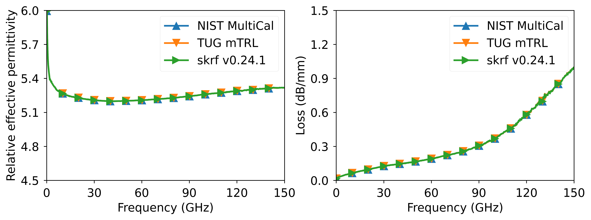
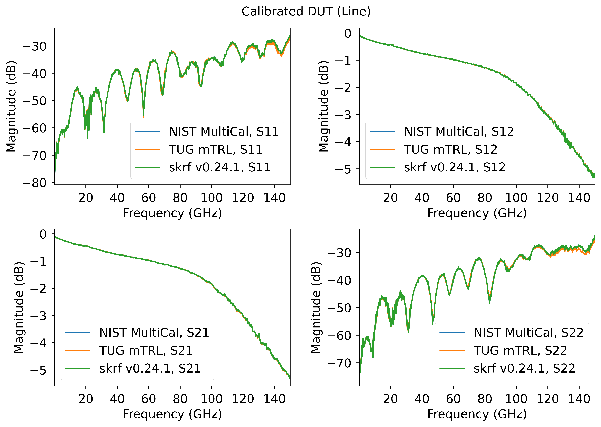
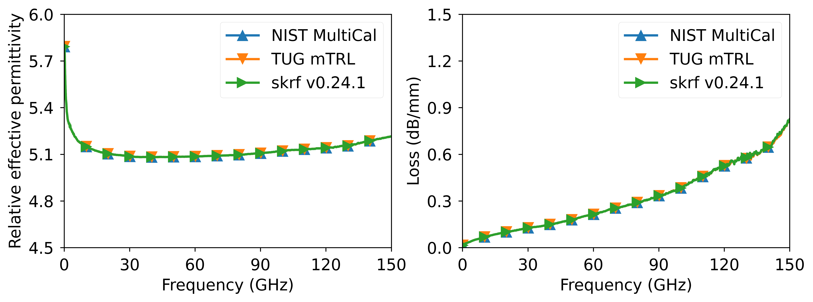
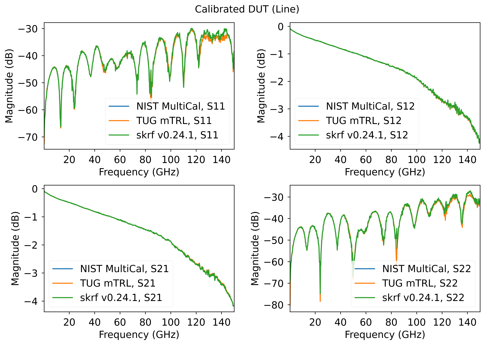
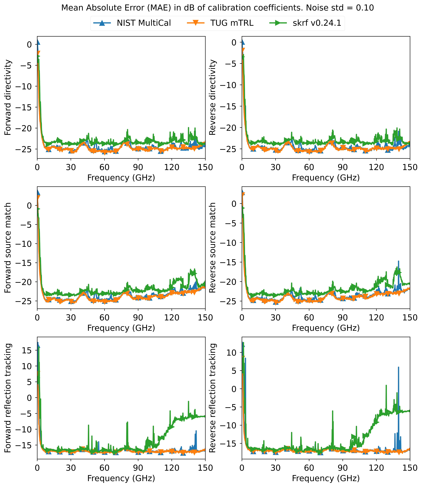
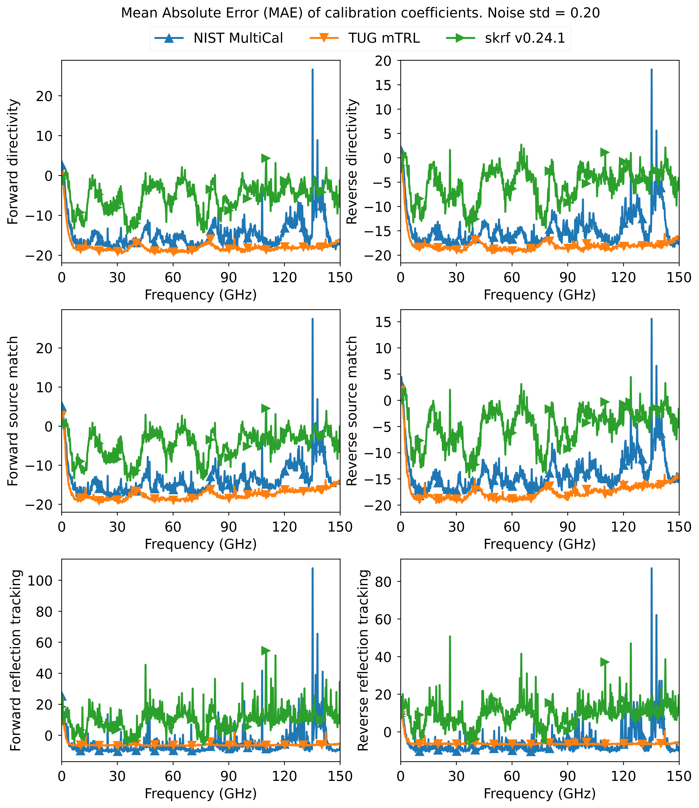

# Multiline TRL Calibration

This repository implements two algorithms for multiline TRL calibration:

1. An "improved" implementation based on my work [1]. The related PowerPoint slides can be found at <https://pure.tugraz.at/ws/portalfiles/portal/46207898/ziad_ARFTG_98_presentation.pdf>
2. The classical MultiCal implementation from NIST [2,3].

For information on uncertainty propagation in the calibration process, see my other repository at <https://github.com/ZiadHatab/uncertainty-multiline-trl-calibration>

In addition, the optimization procedure used to calculate the propagation constant, which was discussed in [1], has been removed and is no longer used in the derivation of the weighting matrix. Instead, the weighting matrix is now derived directly through low-rank Takagi decomposition, as discussed in [4].

## Comparison of Implementations

NIST MultiCal [2,3]:

- Assumes linear error in the measurement and that it can be modeled in the solution of the calibration coefficients (i.e., eigenvectors).
- If the linearity assumption holds, multiple eigenvalue problems can be solved and combined using the Gauss-Markov BLUE estimator (weighted sum) to obtain a combined solution.
- The weights are applied to the solutions (eigenvectors) and not the measurements themselves. Bare in mind the fact that The derived covariance matrix is based under certain simplifications (see [3])

TUG mTRL [1]:

- Makes no assumptions about the type of error found in the  measurement.
- A weighting matrix is derived to optimally combine the measurements (minimizing the eigenvectors sensitivity).
- The weights are applied directly to the measurements, resulting in a single 4x4 combined eigenvalue problem to solve.

## Advantages of TUG mTRL

The TUG mTRL method [1] has several advantages over the NIST MultiCal approach:

- No assumptions about the type of perturbations in the measurements are required.
- A single 4x4 eigenvalue problem to solve, regardless of the number of line measurements taken.
- The method is designed to maximize the eigenvalue separation and minimize the sensitivity of the eigenvectors, leading to improved solution accuracy of the calibration coefficients.

## Code requirements

The three files [`mTRL.py`](https://github.com/ZiadHatab/multiline-trl-calibration/blob/main/mTRL.py), [`MultiCal.py`](https://github.com/ZiadHatab/multiline-trl-calibration/blob/main/MultiCal.py), and [`TUGmTRL.py`](https://github.com/ZiadHatab/multiline-trl-calibration/blob/main/TUGmTRL.py) need to be in the same folder and `mTRL.py` should be loaded in your main script.

You need to have `numpy`, `matplotlib`, and `scikit-rf` installed in your Python environment. To install these packages, run the following command:

```powershell
python -m pip install numpy matplotlib scikit-rf -U
```

## How to use

Below is a sample code on how to run an mTRL calibration:

```python
# MultiCal.py and TUGmTRL.py must also be in same folder.
from mTRL import mTRL
import skrf as rf

# Measured calibration standards
L1    = rf.Network('measured_line_1.s2p')
L2    = rf.Network('measured_line_2.s2p')
L3    = rf.Network('measured_line_3.s2p')
L4    = rf.Network('measured_line_4.s2p')
SHORT = rf.Network('measured_short.s2p')

lines = [L1, L2, L3, L4]
line_lengths = [0, 1e-3, 3e-3, 5e-3]  # in units of meters
reflect = [SHORT]
reflect_est = [-1]
reflect_offset = [0]

# define the calibration
cal = mTRL(lines=lines, line_lengths=line_lengths, reflect=reflect, reflect_est=reflect_est, reflect_offset=reflect_offset)
cal.run_tug()      # run TUGmTRL calibration
# cal.run_multical() # run MultiCal

dut = rf.Network('measured_dut.s2p')
cal_dut = cal.apply_cal(dut) # apply cal to a dut

line_gamma = cal.gamma # estimated propagation constant
line_ereff = cal.ereff # effective dielectric constant
```

## Shifting calibration plane

After you complete the calibration, the mTRL sets the calibration plane in the middle of the first line you specify in the list of lines, regardless of whether it is the shortest or longest. If you want the calibration plane to be in a different location, you can shift the plane after calibration as follows:

```python
cal.shift_plane(d)  # d is the shift in units of meters 
# the cal coefficients are updated with the new cal plane
cal_dut = cal.apply_cal(dut)
```

Here's how you specify *d* (the applied offset), as shown in the image below:


If your Thru standard (the first line) has a non-zero length, and you want the cal plane to be on the edges of the Thru line, you can negatively shift by half of its length:

```python
cal.shift_plane(-thru_length/2)
```

## Renormalizing impedance

By default, the reference impedance after a mTRL calibration is set to the characteristic impedance of the line standards. However, if the used transmission lines have an impedance that's different from what you want (e.g. 50 ohm), you can renormalize the calibration coefficients to any desired impedance by specifying the characteristic impedance of your lines:

```python
cal.renorm_impedance(new_impedance, old_impedance)
# new_impedance: The desired impedance (can be an array, i.e., frequency dependent).
# old_impedance: The old impedance, typically the characteristic impedance of the line standards, unless you've previously renormalized it (also can be an array, i.e., frequency dependent).

cal_dut = cal.apply_cal(dut) # The DUT is now calibrated with the new impedance.
```

## Extracting the 12 error terms

I originally only included a function to return the 6-error terms (3 from each port). After the [feedback](https://github.com/scikit-rf/scikit-rf/discussions/805#discussioncomment-4227698) from @Zwelckovich, I decided to update `error_coef(self)` function to return all 12 error terms. It should be noted that these error terms will be updated automatically if you shift reference plane or perform impedance renormalization.
```python
# forward direction
cal.coefs['EDF'] # forward directivity
cal.coefs['ESF'] # forward source match
cal.coefs['ERF'] # forward reflection tracking
cal.coefs['ELF'] # forward load match
cal.coefs['ETF'] # forward transmission tracking
cal.coefs['EXF'] # forward crosstalk (set to zero!)
cal.coefs['GF']  # forward switch term

# reverse direction
cal.coefs['EDR'] # reverse directivity
cal.coefs['ESR'] # reverse source match
cal.coefs['ERR'] # reverse reflection tracking
cal.coefs['ELR'] # reverse load match
cal.coefs['ETR'] # reverse transmission tracking
cal.coefs['EXR'] # reverse crosstalk (set to zero!)
cal.coefs['GR']  # reverse switch term
```

## Splitting reciprocal error-boxes

If you have reciprocal error-boxes (i.e., S21=S12), you can split them into left and right error-boxes. Use the following function in mTRL to achieve this:

```python
left_ntwk, right_ntwk = cal.reciprocal_ntwk()
```

Keep in mind that the reciprocity of the error-boxes depends on the components they represent. If they are passive components such as connectors, reciprocity is likely to hold. However, if they consist of diodes, ferromagnetic materials, or active devices such as amplifiers, reciprocity most certainly wouldn't hold.

## Using only line measurements

In some applications, calibration is not necessary for its own sake, but rather to extract the propagation constant for other applications. In such scenarios, reflect measurements are unnecessary. With only the line standards, you can calculate the propagation constant. Simply provide the line measurements and set the ``reflect`` variable to ``None``, or do not include it at all.

```Python
   cal = mTRL(lines=lines, line_lengths=line_lengths, ereff_est=5+0j)
```

## Code examples

### example 1 — 2nd-tier calibration

This example demonstrate how to do a simple 2nd tier calibration (de-embedding), where the s2p data were captured using an already calibrated VNA.


*Effective permittivity and loss per unit length.*


*Calibrated line standard.*

### example 2 — 1st-tier calibration

This example demonstrate how to do a full 1st tier calibration (including switch terms). The s2p data are the raw data from the VNA.


*Effective permittivity and loss per unit length.*


*Calibrated line standard.*

### example 3 — statistical comparison

This example demonstrate statistical performance of different mTRL calibrations via Monte-Carlo method (1000 trials). Below is the error of the calibration coefficients due to iid additive noise. Feel free to do your own comparisons with different dataset and uncertainty types.

  |  
:-------------------------:|:-------------------------:

## To-Do

I’m working on staring a GitHub Pages, where I will post the mathematical details of the algorithm. For now, you can refer to [1] and [4]. Also, feedback and discussions are always welcomed. Just post them in the issue forum.

## Crediting

If you found yourself using my mTRL implementation, please consider citing [1] and [4].

## References

* [1] Z. Hatab, M. Gadringer and W. Bösch, "Improving The Reliability of The Multiline TRL Calibration Algorithm," 2022 98th ARFTG Microwave Measurement Conference (ARFTG), 2022, pp. 1-5, doi: [10.1109/ARFTG52954.2022.9844064](http://dx.doi.org/10.1109/ARFTG52954.2022.9844064).

* [2] D. C. DeGroot, J. A. Jargon and R. B. Marks, "Multiline TRL revealed," 60th ARFTG Conference Digest, Fall 2002., Washington, DC, USA, 2002, pp. 131-155, doi: [10.1109/ARFTGF.2002.1218696](http://dx.doi.org/10.1109/ARFTGF.2002.1218696).

* [3] R. B. Marks, "A multiline method of network analyzer calibration," in IEEE Transactions on Microwave Theory and Techniques, vol. 39, no. 7, pp. 1205-1215, July 1991, doi: [10.1109/22.85388](http://dx.doi.org/10.1109/22.85388).

* [4] Z. Hatab, M. Gadringer, and W. Bösch, "Propagation of Linear Uncertainties through Multiline Thru-Reflect-Line Calibration," e-print: [https://arxiv.org/abs/2301.09126](https://arxiv.org/abs/2301.09126)

## About the license

The code in this repository is licensed under the BSD-3-Clause license. Feel free to do whatever you want with the code under limitations of [BSD-3-Clause license](https://github.com/ZiadHatab/multiline-trl-calibration/blob/main/LICENSE).
