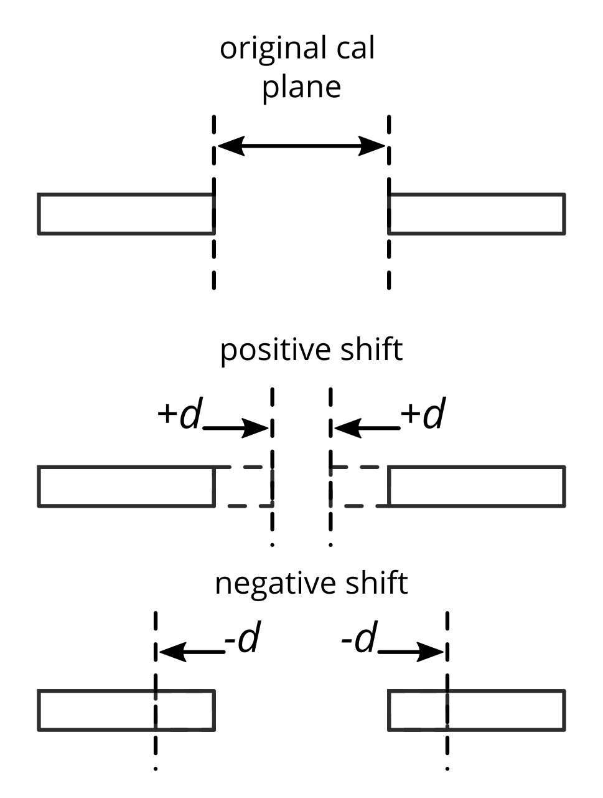
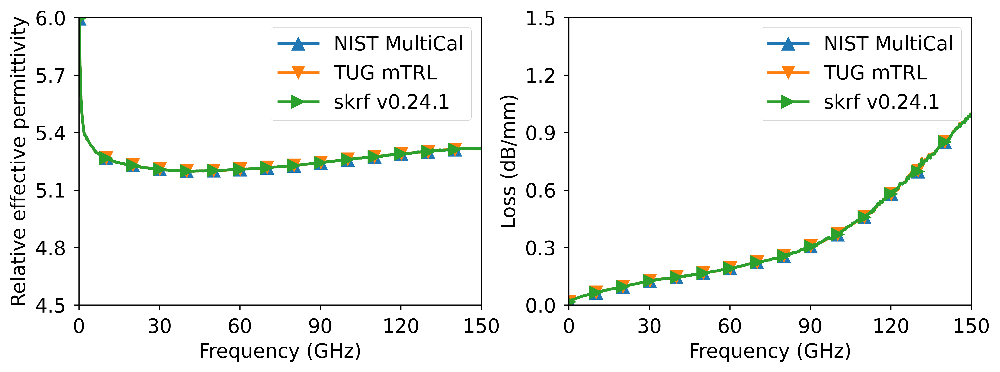
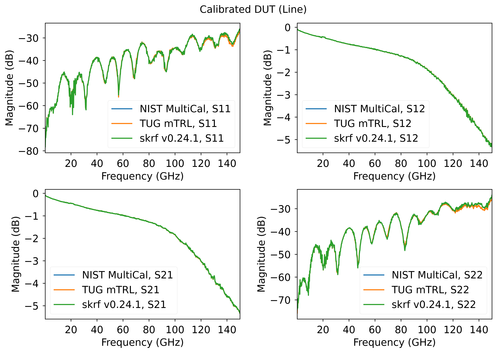
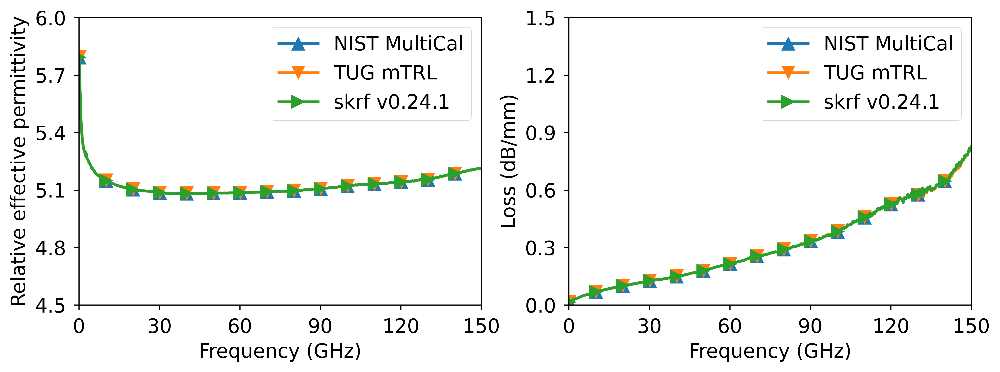
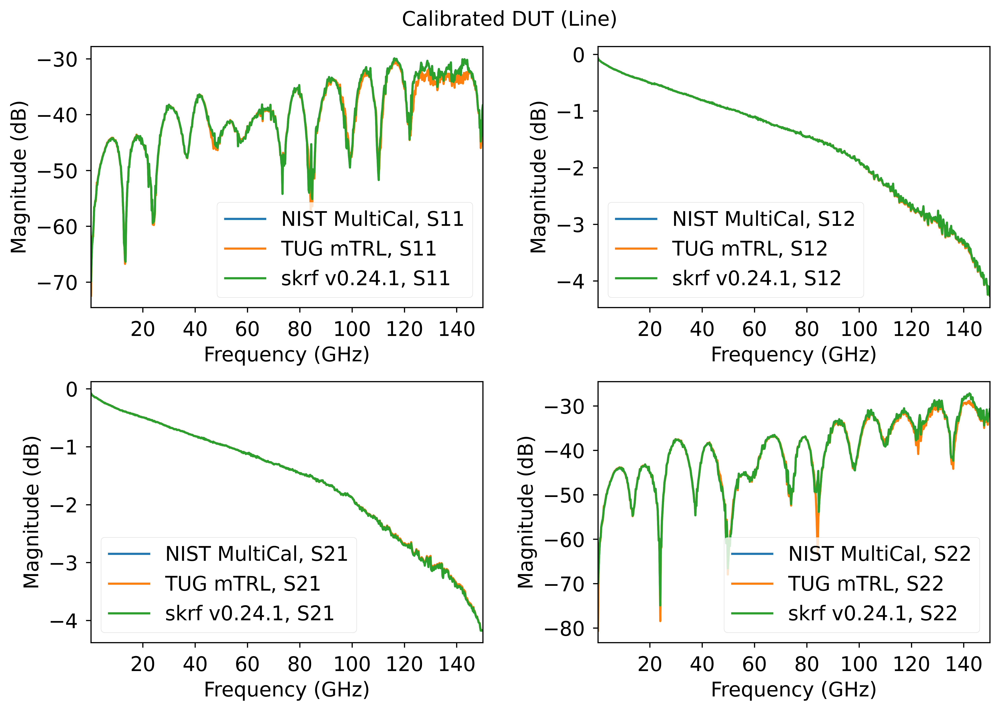
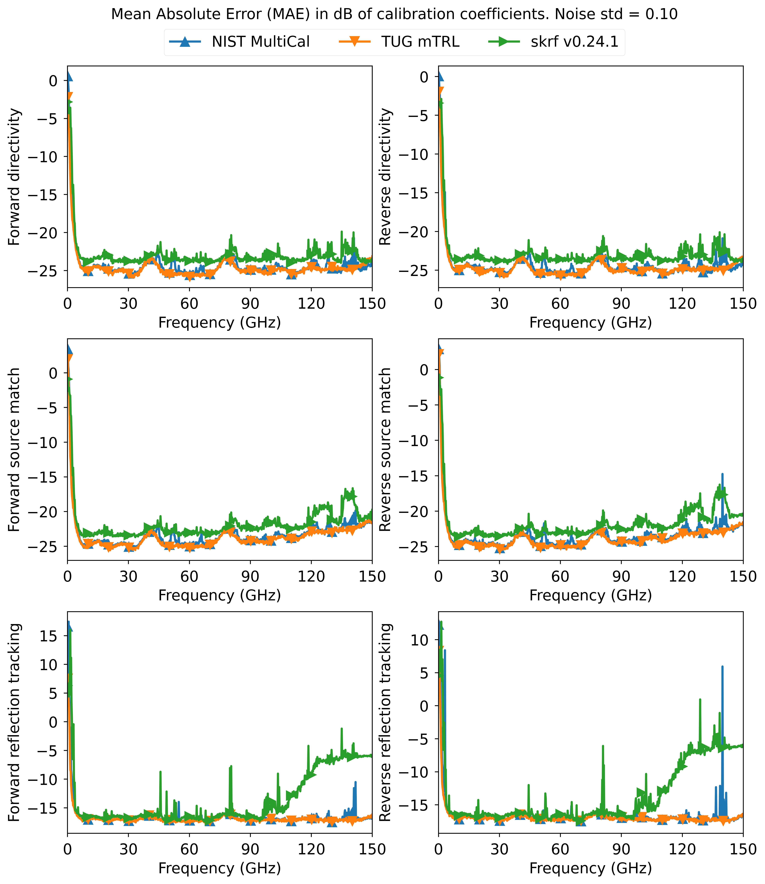
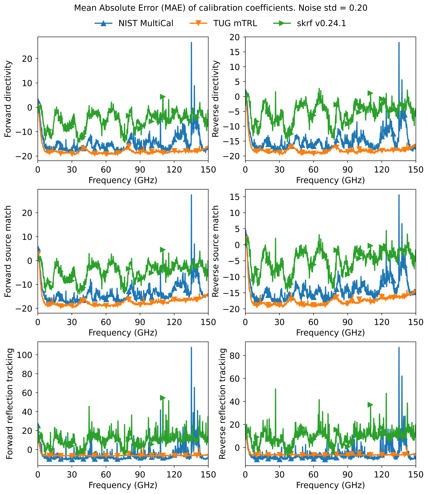

# Multiline TRL Calibration

**NOTE:** The TUG multiline TRL procedure is already part of the [scikit-rf package](https://scikit-rf.readthedocs.io/en/latest/api/calibration/generated/skrf.calibration.calibration.TUGMultilineTRL.html).

This repository contains two multiline TRL calibration implementations:

1. My own _improved_ TUG multiline TRL [1]. Slides are available [here](https://pure.tugraz.at/ws/portalfiles/portal/46207898/ziad_ARFTG_98_presentation.pdf), and the mathematical derivation is on my [website](https://ziadhatab.github.io/posts/multiline-trl-calibration/).

2. The classical MultiCal implementation from NIST [2,3].

The NIST method is included as a reference. Below is a brief comparison; also see the last example for a Monte Carlo comparison.

_NIST multiline TRL [2,3]_:

- Assumes a first-order approximation with respect to any disturbance, including the eigenvectors of line pairs.
- Multiple eigenvalue problems are solved and combined via the Gauss-Markov estimator (weighted sum).
- Weights are applied to the solutions (eigenvectors), not directly to the measurements.
- The covariance matrix used for weighting assumes equal statistical error at both ports.
- A common line is selected during calibration, which can change across frequencies and cause discontinuities.

_TUG multiline TRL [1]_:

- No assumptions are made about the type of statistical error in the measurements.
- A weighting matrix is derived to optimally combine all measurements into a single 4×4 weighted eigenvalue problem.
- The weighting matrix minimizes eigenvector sensitivity by maximizing the eigengap (distance between eigenvalues).
- No common line is needed — all measurements are combined at once.

For uncertainty propagation in multiline calibration, see: <https://github.com/ZiadHatab/uncertainty-multiline-trl-calibration>

For a thru-free multiline method (no thru standard required, nor reference plane shifting), see: <https://github.com/ZiadHatab/thru-free-multiline-calibration>

For guidance on designing calibration kits and specifying line lengths, see: <https://github.com/ZiadHatab/line-length-multiline-trl-calibration>

**NOTE:** The optimization procedure for computing the propagation constant described in [1] has been removed. The weighting matrix is now derived via low-rank Takagi decomposition [4], and the propagation constant is estimated via linear least squares.

## Requirements

The files [`mTRL.py`](https://github.com/ZiadHatab/multiline-trl-calibration/blob/main/mTRL.py), [`MultiCal.py`](https://github.com/ZiadHatab/multiline-trl-calibration/blob/main/MultiCal.py), and [`TUGmTRL.py`](https://github.com/ZiadHatab/multiline-trl-calibration/blob/main/TUGmTRL.py) must all be in the same folder. Load [`mTRL.py`](https://github.com/ZiadHatab/multiline-trl-calibration/blob/main/mTRL.py) in your main script.

Install the required packages with:

```powershell
python -m pip install numpy scikit-rf -U
```

## How to use

```python
# MultiCal.py and TUGmTRL.py must be in the same folder.
from mTRL import mTRL
import skrf as rf

# Measured calibration standards
L1    = rf.Network('measured_line_1.s2p')
L2    = rf.Network('measured_line_2.s2p')
L3    = rf.Network('measured_line_3.s2p')
L4    = rf.Network('measured_line_4.s2p')
SHORT = rf.Network('measured_short.s2p')

lines = [L1, L2, L3, L4]
line_lengths = [0, 1e-3, 3e-3, 5e-3]  # meters
reflect = [SHORT]
reflect_est = [-1]
reflect_offset = [0]

cal = mTRL(lines=lines, line_lengths=line_lengths, reflect=reflect,
           reflect_est=reflect_est, reflect_offset=reflect_offset)
cal.run_tug()      # run TUGmTRL
# cal.run_multical() # run MultiCal

dut = rf.Network('measured_dut.s2p')
cal_dut = cal.apply_cal(dut)

line_gamma = cal.gamma  # propagation constant
line_ereff = cal.ereff  # effective permittivity
```

## Shifting the calibration plane

After calibration, the reference plane is set to the midpoint of the first line in the list. To move it elsewhere:

```python
cal.shift_plane(d)  # d in meters; cal coefficients are updated automatically
cal_dut = cal.apply_cal(dut)
```

The sign convention for *d* is illustrated below:



To place the reference plane at the edges of a non-zero-length thru line:

```python
cal.shift_plane(-thru_length/2)
```

## Renormalizing impedance

By default, the reference impedance after mTRL calibration is the characteristic impedance of the line standards. To renormalize to a different impedance (e.g., 50 Ω):

```python
cal.renorm_impedance(new_impedance, old_impedance)
# Both arguments can be frequency-dependent arrays.

cal_dut = cal.apply_cal(dut)
```

## Extracting the 12 error terms

The `error_coef()` function returns all 12 error terms, which are updated automatically after any plane shift or impedance renormalization.

```python
# Forward
cal.coefs['EDF']  # directivity
cal.coefs['ESF']  # source match
cal.coefs['ERF']  # reflection tracking
cal.coefs['ELF']  # load match
cal.coefs['ETF']  # transmission tracking
cal.coefs['EXF']  # crosstalk (set to zero)
cal.coefs['GF']   # switch term

# Reverse
cal.coefs['EDR']  # directivity
cal.coefs['ESR']  # source match
cal.coefs['ERR']  # reflection tracking
cal.coefs['ELR']  # load match
cal.coefs['ETR']  # transmission tracking
cal.coefs['EXR']  # crosstalk (set to zero)
cal.coefs['GR']   # switch term
```

## Splitting reciprocal error-boxes

To split the calibration into left and right error-boxes (assuming S21 = S12):

```python
left_ntwk, right_ntwk = cal.reciprocal_ntwk()
```

Reciprocity holds for passive structures (e.g., connectors) but not for active or non-reciprocal devices (e.g., amplifiers, ferromagnetic components).

## Line-only calibration

If you only need the propagation constant rather than a full calibration, reflect measurements are unnecessary. Omit `reflect` or set it to `None`:

```python
cal = mTRL(lines=lines, line_lengths=line_lengths, ereff_est=5+0j)
```

## Examples

### Example 1 — 2nd-tier calibration

Simple 2nd-tier calibration (de-embedding) using s2p data from an already-calibrated VNA.


*Effective permittivity and loss per unit length.*


*Calibrated line standard.*

### Example 2 — 1st-tier calibration

Full 1st-tier calibration including switch terms, using raw VNA s2p data.


*Effective permittivity and loss per unit length.*


*Calibrated line standard.*

### Example 3 — Statistical comparison

Monte Carlo comparison (1000 trials) of calibration methods under additive noise. Modify the dataset or noise type for your own analysis.

  |  
:-------------------------:|:-------------------------:
_Low noise_ | _High noise_

## Citing

If you use this code, please cite [1] and [4].

## References

[1] Z. Hatab, M. Gadringer and W. Bösch, "Improving The Reliability of The Multiline TRL Calibration Algorithm," _2022 98th ARFTG Microwave Measurement Conference (ARFTG)_, 2022, pp. 1-5, doi: [10.1109/ARFTG52954.2022.9844064](http://dx.doi.org/10.1109/ARFTG52954.2022.9844064).

[2] D. C. DeGroot, J. A. Jargon and R. B. Marks, "Multiline TRL revealed," _60th ARFTG Conference Digest_, Fall 2002., Washington, DC, USA, 2002, pp. 131-155, doi: [10.1109/ARFTGF.2002.1218696](http://dx.doi.org/10.1109/ARFTGF.2002.1218696).

[3] R. B. Marks, "A multiline method of network analyzer calibration," in _IEEE Transactions on Microwave Theory and Techniques_, vol. 39, no. 7, pp. 1205-1215, July 1991, doi: [10.1109/22.85388](http://dx.doi.org/10.1109/22.85388).

[4] Z. Hatab, M. E. Gadringer, and W. Bösch, "Propagation of Linear Uncertainties through Multiline Thru-Reflect-Line Calibration," in _IEEE Transactions on Instrumentation and Measurement_, vol. 72, pp. 1-9, 2023, doi: [10.1109/TIM.2023.3296123](http://dx.doi.org/10.1109/TIM.2023.3296123).

## License

[](https://github.com/ZiadHatab/multiline-trl-calibration/blob/main/LICENSE)

[numpy]: https://github.com/numpy/numpy
[skrf]: https://github.com/scikit-rf/scikit-rf